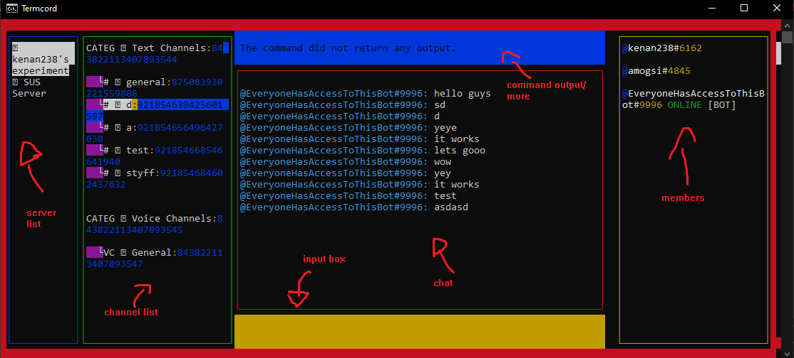

## TermCord
A terminal client for discord made in _Javascript_ using _NodeJS_.

**NOTE**: It only works for bots because of the Discord TOS.

**NOTE**: It's not done, it's still in beta which means it still has a lot of bugs.

It uses [reblessed](https://github.com/kenan238/reblessed) for the TUI and DiscordJS to interact with Discord's API.

Upon startup it will ask you to enter your bot's token to authenticate.

Then it will start loading, after a few moments, you will be greeted with an interface:

In the input box you can enter commands to perform specific actions.

**LIST OF COMMANDS made with [tablesgenerator](https://www.tablesgenerator.com/markdown_tables) its a pretty cool tool you should try it out**
| Command name           | Arguments                                                     | Description                                          |
|------------------------|---------------------------------------------------------------|------------------------------------------------------|
| go_to_guild_by_id      | Integer                                                       | Goes to the guild with the entered id.               |
| go_to_channel_by_id    | Integer                                                       | Goes to the channel with the entered id.             |
| go_to_next_guild       | None                                                          | Goes to the next guild.                              |
| exit                   | None                                                          | Exits TermCord.                                      |
| go_to_next_channel     | None                                                          | Goes to the next channel.                            |
| get_current_guild_id   | None                                                          | Gets the id of the current guild.                    |
| get_current_channel_id | None                                                          | Gets the id of the current channel.                  |
| remove_system_messages | None                                                          | Removes all system messages.                         |
| user_profile           | User: name#tag & String: id / tag / avatar / name / createdAt | Fetches the needed information from a user's profile |
| join_vc                | None                                                          | Joins the VC channel if the current channel is VC.   |
| refresh                | None                                                          | Refreshes the UI.                                    |
| mute                   | None                                                          | Mutes/Unmutes you if in VC. (NOT IMPLEMENTED)        |
| deafen                 | None                                                          | Deafens/Undeafens you if in VC. (NOT IMPLEMENTED)    |
| get_roles              | Integer: user id                                              | Gets a user's roles in the current server.           |
| is_connected_in_vc     | None                                                          | Shows if you are connected in a VC.                  |
| get_invite             | None                                                          | Creates an invite for the current server             |

Any pull requests/contributions are very much appreciated :).

**License is MIT**